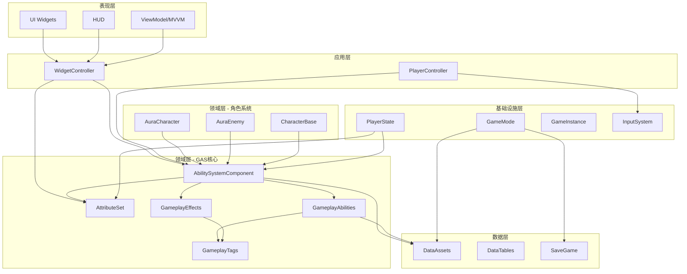

# Aura 项目架构总览

> **项目名称**: GameplayAbilitySystem_Aura  
> **引擎版本**: Unreal Engine 5.7  
> **开发语言**: C++ / Blueprint  
> **架构模式**: 分层架构 + MVVM + 数据驱动  
> **文档版本**: v1.0  
> **更新日期**: 2026-01-24

---

## 📋 目录

1. [项目概述](#项目概述)
2. [架构设计理念](#架构设计理念)
3. [整体架构图](#整体架构图)
4. [分层架构](#分层架构)
5. [核心技术栈](#核心技术栈)
6. [模块依赖关系](#模块依赖关系)
7. [设计模式应用](#设计模式应用)
8. [数据流向](#数据流向)

---

## 🎯 项目概述

### 项目简介
Aura 是一个基于 Unreal Engine 5.7 的 ARPG（动作角色扮演游戏）项目，深度集成了 **Gameplay Ability System (GAS)**，实现了完整的角色能力系统、属性系统、战斗系统和 UI 交互系统。

### 核心特性
- ✅ **完整的 GAS 集成** - 技能、属性、效果、标签系统
- ✅ **MVVM UI 架构** - 数据驱动的用户界面
- ✅ **网络多人支持** - 属性复制、RPC 调用
- ✅ **数据驱动设计** - DataAssets 和 DataTables 配置
- ✅ **模块化架构** - 清晰的职责分离
- ✅ **接口解耦** - 基于接口的多态设计
- ✅ **存档系统** - 完整的游戏进度保存

### 项目规模
```
总代码文件数: 150+
核心模块数: 12
技能类型数: 5+
属性数量: 20+
文档数量: 45+
```

---

## 💡 架构设计理念

### 1. **分层架构 (Layered Architecture)**
项目采用清晰的分层设计，每层职责明确，降低耦合度：

```
┌─────────────────────────────────────┐
│      表现层 (Presentation)          │  ← UI、Widget、HUD
├─────────────────────────────────────┤
│      应用层 (Application)           │  ← WidgetController、ViewModel
├─────────────────────────────────────┤
│      领域层 (Domain)                │  ← GAS、Character、Combat
├─────────────────────────────────────┤
│      基础设施层 (Infrastructure)    │  ← GameMode、PlayerState、Input
├─────────────────────────────────────┤
│      数据层 (Data)                  │  ← DataAssets、SaveGame
└─────────────────────────────────────┘
```

### 2. **数据驱动 (Data-Driven)**
- 使用 **DataAssets** 配置技能、属性、角色类别
- 使用 **DataTables** 管理等级、战利品、技能信息
- 减少硬编码，提高可维护性和扩展性

### 3. **接口解耦 (Interface Decoupling)**
- `ICombatInterface` - 战斗相关功能
- `IPlayerInterface` - 玩家特定功能
- `IEnemyInterface` - 敌人特定功能
- `IHighlightInterface` - 高亮交互
- `ISaveInterface` - 存档功能

### 4. **组合优于继承 (Composition over Inheritance)**
- 使用 **AbilitySystemComponent** 组合能力
- 使用 **AttributeSet** 组合属性
- 使用 **Niagara Components** 组合视觉效果

### 5. **事件驱动 (Event-Driven)**
- 使用 **Delegates** 进行组件间通信
- 使用 **GameplayTags** 进行事件标识
- 减少直接依赖，提高灵活性

---

## 🏗️ 整体架构图



---

## 📚 分层架构

### 第一层：表现层 (Presentation Layer)
**职责**: 负责所有用户界面的显示和交互

| 模块 | 说明 | 关键类 |
|------|------|--------|
| **UI Widgets** | 具体的 UI 控件 | `AuraUserWidget`, `LoadScreenWidget` |
| **HUD** | 游戏内 HUD 管理 | `AuraHUD`, `LoadScreenHUD` |
| **ViewModel** | MVVM 模式的 ViewModel | `MVVM_LoadScreen`, `MVVM_LoadSlot` |
| **Damage Text** | 伤害数字显示 | `DamageTextComponent` |

**特点**:
- 纯展示逻辑，不包含业务逻辑
- 通过 WidgetController 获取数据
- 使用 Blueprint 实现具体 UI 样式

---

### 第二层：应用层 (Application Layer)
**职责**: 协调表现层和领域层，处理用户交互逻辑

| 模块 | 说明 | 关键类 |
|------|------|--------|
| **WidgetController** | UI 数据控制器 | `AuraWidgetController`, `OverlayWidgetController` |
| **AttributeMenu** | 属性菜单控制器 | `AttributeMenuWidgetController` |
| **SpellMenu** | 技能菜单控制器 | `SpellMenuWidgetController` |
| **PlayerController** | 玩家输入控制 | `AuraPlayerController` |

**特点**:
- 实现 MVVM 模式的 ViewModel 角色
- 监听 GAS 事件并更新 UI
- 处理用户输入并调用领域层

---

### 第三层：领域层 (Domain Layer)
**职责**: 核心业务逻辑，包括 GAS 系统和角色系统

#### 3.1 GAS 核心模块

| 子模块 | 说明 | 关键类 |
|--------|------|--------|
| **AbilitySystemComponent** | GAS 核心组件 | `AuraAbilitySystemComponent` |
| **AttributeSet** | 属性集合 | `AuraAttributeSet` |
| **GameplayAbilities** | 技能实现 | `AuraGameplayAbility`, `AuraProjectileSpell` |
| **GameplayEffects** | 效果计算 | `ExecCalc_Damage`, `MMC_MaxHealth` |
| **GameplayTags** | 标签系统 | `FAuraGameplayTags` |
| **AbilityTypes** | 自定义类型 | `FAuraGameplayEffectContext`, `FDamageEffectParams` |

#### 3.2 角色系统模块

| 子模块 | 说明 | 关键类 |
|--------|------|--------|
| **CharacterBase** | 角色基类 | `AAuraCharacterBase` |
| **Player** | 玩家角色 | `AAuraCharacter` |
| **Enemy** | 敌人角色 | `AAuraEnemy` |
| **Combat** | 战斗逻辑 | `ICombatInterface` |

#### 3.3 技能系统模块

| 技能类型 | 说明 | 示例类 |
|----------|------|--------|
| **投射物技能** | 发射投射物 | `AuraFireBolt`, `ArcaneShards` |
| **光束技能** | 持续光束 | `AuraBeamSpell`, `Electrocute` |
| **近战技能** | 近战攻击 | `AuraMeleeAttack` |
| **召唤技能** | 召唤生物 | `AuraSummonAbility` |
| **被动技能** | 被动效果 | `AuraPassiveAbility` |

---

### 第四层：基础设施层 (Infrastructure Layer)
**职责**: 提供游戏框架和基础服务

| 模块 | 说明 | 关键类 |
|------|------|--------|
| **GameMode** | 游戏模式管理 | `AuraGameModeBase` |
| **PlayerState** | 玩家状态 | `AuraPlayerState` |
| **GameInstance** | 游戏实例 | `AuraGameInstance` |
| **Input** | 输入系统 | `AuraInputComponent`, `AuraInputConfig` |
| **AI** | AI 系统 | `AuraAIController`, `BTTask_Attack` |
| **Checkpoint** | 检查点系统 | `Checkpoint`, `MapEntrance` |

---

### 第五层：数据层 (Data Layer)
**职责**: 数据配置和持久化

| 模块 | 说明 | 关键类 |
|------|------|--------|
| **DataAssets** | 数据资产 | `CharacterClassInfo`, `AbilityInfo` |
| **DataTables** | 数据表 | `LevelUpInfo`, `LootTiers` |
| **SaveGame** | 存档系统 | `LoadScreenSaveGame` |
| **AssetManager** | 资源管理 | `AuraAssetManager` |

---

## 🛠️ 核心技术栈

### Unreal Engine 核心插件
```cpp
// Aura.Build.cs
PublicDependencyModuleNames.AddRange(new string[] { 
    "Core", 
    "CoreUObject", 
    "Engine", 
    "InputCore",
    "EnhancedInput",           // 增强输入系统
    "GameplayAbilities",       // GAS 核心
    "GameplayTags",            // 标签系统
    "GameplayTasks",           // 任务系统
    "Niagara",                 // 粒子系统
    "AIModule",                // AI 系统
    "NavigationSystem",        // 导航系统
    "UMG",                     // UI 系统
    "MotionWarping"            // 动作扭曲
});
```

### 设计模式
- **MVVM** - UI 架构
- **单例模式** - GameplayTags 管理
- **工厂模式** - 技能创建
- **观察者模式** - 事件委托
- **策略模式** - 伤害计算
- **命令模式** - 输入处理
- **对象池模式** - 投射物管理（可优化）

### 网络架构
- **Client-Server** 架构
- **属性复制** - `UPROPERTY(Replicated)`
- **RPC 调用** - `UFUNCTION(Server/Client, Reliable)`
- **网络预测** - GAS 内置支持

---

## 🔗 模块依赖关系

### 依赖层次（从上到下）
```
UI Layer
  ↓ 依赖
WidgetController Layer
  ↓ 依赖
GAS Layer + Character Layer
  ↓ 依赖
GameFramework Layer
  ↓ 依赖
Data Layer
```

### 核心依赖规则
1. **上层可以依赖下层**，下层不能依赖上层
2. **同层之间通过接口通信**，减少直接依赖
3. **数据层被所有层依赖**，但不依赖任何层
4. **GAS 层相对独立**，可以单独提取为插件

---

## 🎨 设计模式应用

### 1. MVVM 模式
```
View (Widget Blueprint)
  ↓ 绑定
ViewModel (WidgetController)
  ↓ 监听
Model (AttributeSet, AbilitySystemComponent)
```

**优势**:
- UI 和业务逻辑分离
- 数据驱动的 UI 更新
- 易于测试和维护

### 2. 单例模式
```cpp
// FAuraGameplayTags - 全局标签管理
struct FAuraGameplayTags
{
    static const FAuraGameplayTags& Get() { return GameplayTags; }
    static void InitializeNativeGameplayTags();
private:
    static FAuraGameplayTags GameplayTags;
};
```

### 3. 观察者模式
```cpp
// 委托系统
DECLARE_MULTICAST_DELEGATE_OneParam(FOnPlayerStatChanged, int32);

// 订阅
PlayerState->OnXPChangedDelegate.AddUObject(this, &UWidget::OnXPChanged);

// 发布
OnXPChangedDelegate.Broadcast(NewXP);
```

### 4. 策略模式
```cpp
// 伤害计算策略
class UExecCalc_Damage : public UGameplayEffectExecutionCalculation
{
    virtual void Execute_Implementation(...) override;
};
```

---

## 🌊 数据流向

### 1. 玩家输入流
```
玩家输入
  → EnhancedInput
  → AuraPlayerController
  → AuraInputComponent
  → AbilitySystemComponent
  → GameplayAbility
  → 执行技能逻辑
```

### 2. 属性变化流
```
GameplayEffect 应用
  → AttributeSet::PreAttributeChange
  → AttributeSet::PostGameplayEffectExecute
  → 属性值变化
  → OnRep_Attribute (网络复制)
  → WidgetController 监听
  → UI 更新
```

### 3. 伤害计算流
```
技能激活
  → 创建 GameplayEffectSpec
  → 设置 EffectContext (暴击、格挡等)
  → ExecCalc_Damage 计算
  → 应用到目标 AttributeSet
  → 触发 OnDamage 委托
  → 显示伤害数字
```

### 4. UI 更新流
```
属性变化
  → AttributeSet 广播委托
  → WidgetController 接收
  → 更新 ViewModel 数据
  → UI Widget 自动刷新
```

---

## 📊 项目统计

### 代码分布
```
AbilitySystem/     : 35%  (GAS 核心)
Character/         : 20%  (角色系统)
UI/                : 20%  (用户界面)
Player/            : 10%  (玩家相关)
Game/              : 5%   (游戏框架)
AI/                : 5%   (AI 系统)
其他               : 5%   (工具、Actor 等)
```

### 复杂度评估
- **整体复杂度**: ⭐⭐⭐⭐ (中高)
- **GAS 集成**: ⭐⭐⭐⭐⭐ (高)
- **网络支持**: ⭐⭐⭐⭐ (中高)
- **可维护性**: ⭐⭐⭐⭐ (良好)
- **可扩展性**: ⭐⭐⭐⭐ (良好)

---

## 🚀 架构优势

### ✅ 优点
1. **清晰的分层** - 职责明确，易于理解
2. **高度解耦** - 接口驱动，降低依赖
3. **数据驱动** - 配置化，易于调整
4. **完整的 GAS** - 强大的能力系统
5. **MVVM UI** - 数据绑定，自动更新
6. **网络支持** - 完整的多人游戏支持
7. **文档完善** - 45+ 详细文档

### ⚠️ 可优化点
1. **性能优化** - 对象池、异步加载
2. **事件总线** - 减少委托链
3. **模块化** - 提取为独立插件
4. **配置化技能** - 减少 C++ 类数量
5. **ECS 架构** - 更灵活的组合（可选）

---

## 📖 相关文档

- [02_GAS系统详解.md](./02_GAS系统详解.md)
- [03_角色系统架构.md](./03_角色系统架构.md)
- [04_UI架构设计.md](./04_UI架构设计.md)
- [05_数据驱动设计.md](./05_数据驱动设计.md)
- [06_网络架构.md](./06_网络架构.md)
- [07_重构建议.md](./07_重构建议.md)

---

## 📝 版本历史

| 版本 | 日期 | 说明 |
|------|------|------|
| v1.0 | 2026-01-24 | 初始版本，完整架构梳理 |

---

**文档维护**: 请在架构发生重大变更时更新此文档  
**反馈渠道**: 如有疑问或建议，请联系架构负责人
